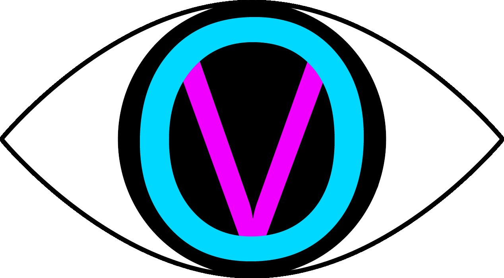

# **OpenVis**

A real-time audio visualizer built with PyQt6, featuring an oscilloscope and spectrum analyzer with customizable themes, input devices, and visual settings.

---

## Features

* Oscilloscope

  * Smooth waveform rendering
  * Adjustable zoom and line thickness
  * Peak hold indicator

* Spectrum Analyzer

  * Log-scaled frequency bands
  * Configurable bar count (64–512)
  * Multiple window functions (Hanning, Hamming, Blackman, etc.)
  * Peak hold per frequency band

* Customizable UI

  * Built-in themes (Green, Cyan, Amber, Purple, Red, White)
  * Fully customizable colors (waveform, background, grid)

* Audio Input

  * Select from available input devices
  * Stereo to mono mixing
  * Real-time processing using sounddevice

* Persistent Settings

  * Automatically saves to:
    dat/sve/settings.json

---

## Screenshots

* Top: Oscilloscope waveform 
  
* Bottom: Frequency spectrum
  
* Bottom bar: Peak and RMS levels
  
* All Together (Each element can be resized)
  

---

## Requirements

* Python 3.9+
* Dependencies:
  pip install numpy sounddevice PyQt6

---

## Running the App

* python src/main.py
    or
* run.bat

---

## Controls

Input Device

* Select your microphone or system audio input
* Click "Apply device" to switch

Theme

* Choose a preset theme or customize colors manually

Oscilloscope

* Zoom: Controls how much of the waveform is visible
* Line Thickness: Adjust waveform thickness

Spectrum

* Bar Count: Number of frequency bars
* Window Function: FFT windowing method

Gain

* Amplifies input signal (x0.1 – x8.0)

Peak Hold

* Toggles peak indicators on/off

Save Settings

* Stores current configuration for next launch

---

## How It Works

* Audio is captured using sounddevice.InputStream
* Samples are buffered and smoothed
* Oscilloscope displays time-domain waveform
* Spectrum uses:

  * Windowing function
  * FFT (numpy.fft.rfft)
  * Logarithmic frequency binning
* Visuals rendered via QPainter

---

## Configuration File

Settings are saved to:
dat/sve/settings.json

**Example:**
  ```
  {
  "theme": "grey",
  "osc_color": "#939e9e",
  "bg_color": "#0a0a12",
  "grid_color": "#1e1e32",
  "zoom": 1.0,
  "thickness": 3,
  "bar_count": 128,
  "gain": 5.4,
  "peak_hold": false,
  "window_fn": "hanning",
  "device": 19,
  "show_osc": true,
  "show_spec": false,
  "show_lufs": false
  }
  ```

---

## Known Issues

* On some systems, UI scaling (HiDPI) may cause slight layout clipping
* Input devices depend on OS/audio drivers
* Very high bar counts may impact performance on slower machines

---

## Future Improvements

* Audio playback visualization (not just input)
* Plugin system for custom effects
* Export / recording support
* More advanced color gradients
* GPU acceleration

---

## License

MIT License

---

## Built With

* PyQt6
* numpy
* sounddevice
